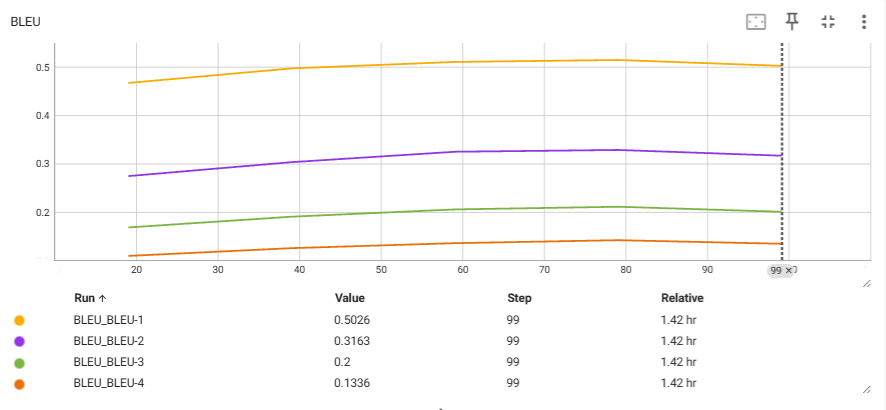
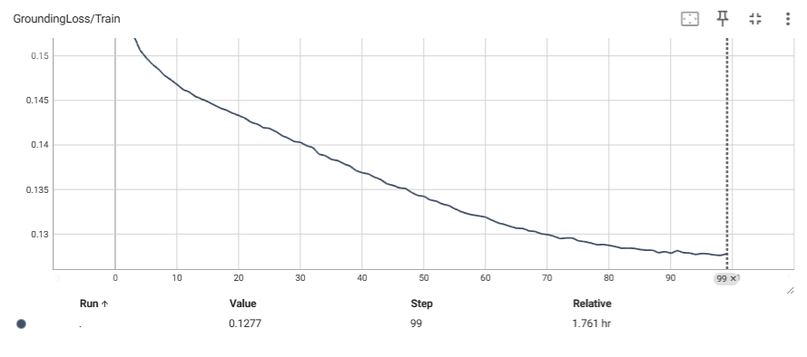
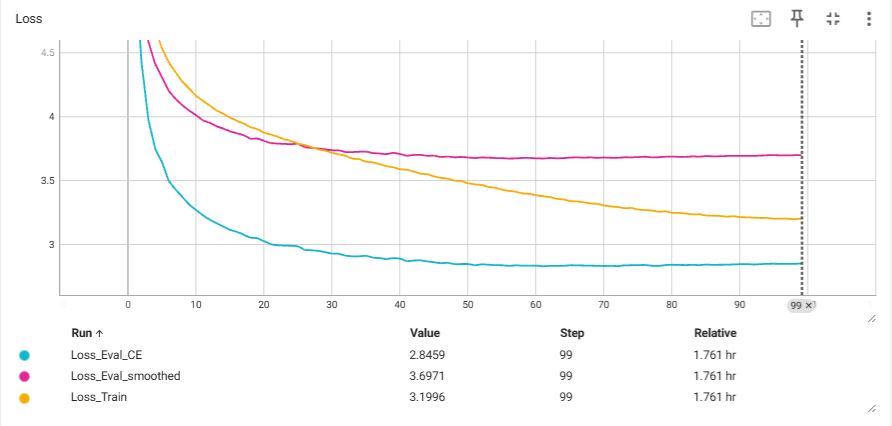
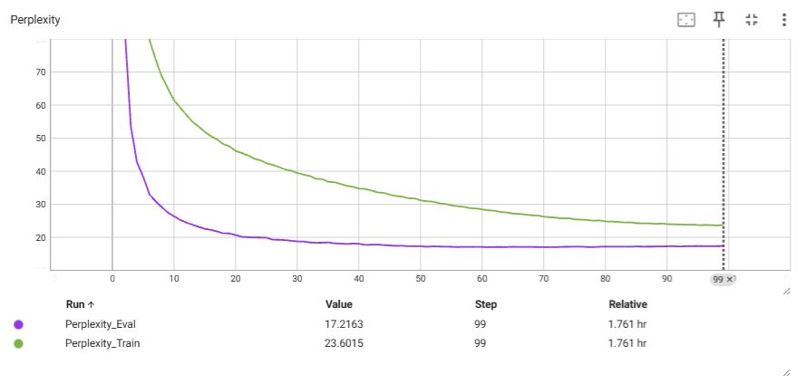

# VisionCaptionGPT

An end-to-end image captioning Transformer built completely from scratch in PyTorch, combining a custom CNN encoder, Visual Transformer encoder, GPT-style decoder, cross-attention, beam search, and BLEU evaluation.
---

## Features

* Custom CNN image encoder
* Visual Transformer encoder
* GPT-style autoregressive decoder
* Multi-head cross-attention
* Learnable cross-attention gating
* Beam Search decoding
* BLEU-1 / BLEU-2 / BLEU-3 / BLEU-4 evaluation
* Image-level dataset splitting
* Vocabulary and tokenizer implemented from scratch
* Linear warmup + cosine learning-rate scheduler
* Mixed deterministic caption scheduling for multi-caption datasets

---

## Architecture

```text
                    Image
                      │
              Custom CNN Encoder
                      │
                 LayerNorm
                      │
         Visual Transformer Encoder
                      │
             Image Feature Tokens
                      │
                      ▼
        ┌──────────────────────────────┐
        │ GPT-style Transformer Decoder│
        └──────────────────────────────┘
                      ▲
            Cross Attention
                      ▲
      Caption Embedding + Positional Encoding
                      │
                Generated Caption
```

### Decoder Layer

Each decoder block contains:

```text
LayerNorm
      │
Masked Self Attention
      │
LayerNorm
      │
Cross Attention (Image Features)
      │
LayerNorm
      │
Feed Forward Network
```

Cross-attention uses a learnable gate:

```text
gate = sigmoid(cross_gate)

output = residual + gate × cross_attention
```

---

## Dataset

**Dataset**

* Flickr8k

**Split Strategy**

* Image-level split
* No image appears in both training and validation
* Each image contains five reference captions

**Training**

* One caption selected per image each epoch
* Caption selection cycles through all references during training

**Validation**

* Fixed reference caption for loss computation
* All five reference captions used for BLEU evaluation

---

## Tokenization

Implemented completely from scratch.

Components include:

* Text cleaning
* Tokenizer
* Vocabulary builder
* Integer encoding
* Decoding
* Special tokens

---

## Model Configuration

| Parameter              | Value                        |
| ---------------------- | ---------------------------- |
| Image Size             | 224 × 224                    |
| Vocabulary Size        | 5000                         |
| Embedding Dimension    | 256                          |
| Attention Heads        | 8                            |
| Decoder Layers         | 4                            |
| Feed Forward Dimension | 1024                         |
| Maximum Caption Length | 30                          |
| Batch Size             | 128                          |
| Optimizer              | AdamW                        |
| Scheduler              | Linear Warmup + Cosine Decay |
| Gradient Clipping      | 1.0                          |

---

## Training 

Loss:

* Cross Entropy Loss
* Label Smoothing

Metrics:

* Training Loss
* Validation Loss
* Training Perplexity
* Validation Perplexity
* BLEU-1
* BLEU-2
* BLEU-3
* BLEU-4

---

## Beam Search

The model performs autoregressive caption generation using Beam Search.

Current decoding supports:

* Configurable beam size
* Length normalization
* Early stopping on EOS token

---

## Results

### Training Logs

```text

1. Load dataset...
2. Initialize tokenizer...
3. Build vocabulary...
RAW: Four teens in school uniforms walk down a tropical road .
CLEANED: four teens in school uniforms walk down a tropical road
TOKENS: ['four', 'teens', 'in', 'school', 'uniforms', 'walk', 'down', 'a', 'tropical', 'road']
ENCODED: [120, 2167, 5, 730, 369, 174, 40, 4, 1669, 158]
DECODED: ['four', 'teens', 'in', 'school', 'uniforms', 'walk', 'down', 'a', 'tropical', 'road']
VOCAB SIZE: 5000
TRAIN IMAGES: 6472
VALID IMAGES: 1619
TRAIN CAPTIONS: 32360
3b. Build grounding concept vocab...
GROUNDING CONCEPTS: 300
SAMPLE CONCEPTS: ['man', 'wearing', 'two', 'white', 'black', 'young', 'dog', 'red', 'brown', 'people', 'blue', 'boy', 'playing', 'woman', 'standing']
4. Create preprocessor...
5. Create datasets...
6. Initialize model...
Total Steps   : 5100
Warmup Steps  : 255
Epoch 1/100 | T-Loss: 8.1304 | T-CE: 7.9478 | G: 0.6089 | V-CE: 6.9465 | V-PPL: 1039.5231 | gate: 0.88/0.88/0.88/0.88 | LR: 0.000100
Epoch 2/100 | T-Loss: 6.5709 | T-CE: 6.4851 | G: 0.2861 | V-CE: 5.2076 | V-PPL: 182.6501 | gate: 0.88/0.88/0.88/0.88 | LR: 0.000200
Epoch 3/100 | T-Loss: 5.4884 | T-CE: 5.4398 | G: 0.1621 | V-CE: 4.4242 | V-PPL: 83.4424 | gate: 0.88/0.88/0.88/0.88 | LR: 0.000300
Epoch 4/100 | T-Loss: 4.9567 | T-CE: 4.9111 | G: 0.1523 | V-CE: 3.9774 | V-PPL: 53.3769 | gate: 0.88/0.88/0.88/0.88 | LR: 0.000400
Epoch 5/100 | T-Loss: 4.6928 | T-CE: 4.6476 | G: 0.1507 | V-CE: 3.7500 | V-PPL: 42.5222 | gate: 0.88/0.88/0.88/0.88 | LR: 0.000500
Epoch 6/100 | T-Loss: 4.5335 | T-CE: 4.4886 | G: 0.1498 | V-CE: 3.6442 | V-PPL: 38.2515 | gate: 0.88/0.88/0.88/0.88 | LR: 0.000500
Epoch 7/100 | T-Loss: 4.4248 | T-CE: 4.3801 | G: 0.1491 | V-CE: 3.4944 | V-PPL: 32.9311 | gate: 0.88/0.88/0.88/0.88 | LR: 0.000499
Epoch 8/100 | T-Loss: 4.3471 | T-CE: 4.3025 | G: 0.1485 | V-CE: 3.4273 | V-PPL: 30.7949 | gate: 0.87/0.88/0.88/0.88 | LR: 0.000499
Epoch 9/100 | T-Loss: 4.2731 | T-CE: 4.2288 | G: 0.1478 | V-CE: 3.3683 | V-PPL: 29.0300 | gate: 0.87/0.87/0.88/0.88 | LR: 0.000498
Epoch 10/100 | T-Loss: 4.2190 | T-CE: 4.1748 | G: 0.1473 | V-CE: 3.3089 | V-PPL: 27.3538 | gate: 0.87/0.87/0.88/0.88 | LR: 0.000497
Epoch 11/100 | T-Loss: 4.1617 | T-CE: 4.1177 | G: 0.1468 | V-CE: 3.2667 | V-PPL: 26.2236 | gate: 0.87/0.87/0.88/0.88 | LR: 0.000495
Epoch 12/100 | T-Loss: 4.1243 | T-CE: 4.0805 | G: 0.1462 | V-CE: 3.2255 | V-PPL: 25.1660 | gate: 0.87/0.87/0.88/0.88 | LR: 0.000494
Epoch 13/100 | T-Loss: 4.0866 | T-CE: 4.0429 | G: 0.1459 | V-CE: 3.1918 | V-PPL: 24.3313 | gate: 0.87/0.87/0.88/0.88 | LR: 0.000492
Epoch 14/100 | T-Loss: 4.0483 | T-CE: 4.0047 | G: 0.1454 | V-CE: 3.1653 | V-PPL: 23.6970 | gate: 0.87/0.87/0.88/0.88 | LR: 0.000490
Epoch 15/100 | T-Loss: 4.0219 | T-CE: 3.9784 | G: 0.1451 | V-CE: 3.1368 | V-PPL: 23.0298 | gate: 0.87/0.87/0.87/0.88 | LR: 0.000487
Epoch 16/100 | T-Loss: 3.9912 | T-CE: 3.9477 | G: 0.1449 | V-CE: 3.1106 | V-PPL: 22.4352 | gate: 0.87/0.87/0.87/0.88 | LR: 0.000485
Epoch 17/100 | T-Loss: 3.9653 | T-CE: 3.9220 | G: 0.1445 | V-CE: 3.0960 | V-PPL: 22.1086 | gate: 0.86/0.87/0.87/0.88 | LR: 0.000482
Epoch 18/100 | T-Loss: 3.9461 | T-CE: 3.9028 | G: 0.1441 | V-CE: 3.0743 | V-PPL: 21.6347 | gate: 0.86/0.86/0.87/0.88 | LR: 0.000478
Epoch 19/100 | T-Loss: 3.9161 | T-CE: 3.8729 | G: 0.1439 | V-CE: 3.0481 | V-PPL: 21.0748 | gate: 0.86/0.86/0.87/0.88 | LR: 0.000475
Epoch 20/100 | T-Loss: 3.9023 | T-CE: 3.8592 | G: 0.1436 | V-CE: 3.0468 | V-PPL: 21.0488 | B-1: 0.4671 | B-2: 0.2740 | B-3: 0.1675 | B-4: 0.1085 | len p/r: 11.5/10.8 | gate: 0.86/0.86/0.87/0.88 | LR: 0.000471

==============================
Image: 1089181217_ee1167f7af.jpg
Prediction: a black and white dog is running through the grass

Ground Truth:
1. a brown dog running down a paved pathway
2. A brown dog running next to grass .
3. A dog is running down a road .
4. A light brown dog runs down a path happily .
5. Energetic brown dog running
==============================

 *** Saved (best BLEU-4)
Epoch 21/100 | T-Loss: 3.8723 | T-CE: 3.8294 | G: 0.1433 | V-CE: 3.0221 | V-PPL: 20.5338 | gate: 0.86/0.86/0.87/0.88 | LR: 0.000468
Epoch 22/100 | T-Loss: 3.8586 | T-CE: 3.8157 | G: 0.1430 | V-CE: 2.9974 | V-PPL: 20.0341 | gate: 0.86/0.86/0.87/0.88 | LR: 0.000464
Epoch 23/100 | T-Loss: 3.8416 | T-CE: 3.7989 | G: 0.1425 | V-CE: 2.9903 | V-PPL: 19.8919 | gate: 0.86/0.86/0.87/0.88 | LR: 0.000459
Epoch 24/100 | T-Loss: 3.8199 | T-CE: 3.7772 | G: 0.1423 | V-CE: 2.9871 | V-PPL: 19.8275 | gate: 0.86/0.86/0.87/0.87 | LR: 0.000455
Epoch 25/100 | T-Loss: 3.8085 | T-CE: 3.7660 | G: 0.1419 | V-CE: 2.9861 | V-PPL: 19.8084 | gate: 0.86/0.86/0.87/0.87 | LR: 0.000450
Epoch 26/100 | T-Loss: 3.7867 | T-CE: 3.7441 | G: 0.1418 | V-CE: 2.9830 | V-PPL: 19.7473 | gate: 0.85/0.86/0.87/0.87 | LR: 0.000445
Epoch 27/100 | T-Loss: 3.7760 | T-CE: 3.7335 | G: 0.1415 | V-CE: 2.9522 | V-PPL: 19.1479 | gate: 0.85/0.86/0.87/0.87 | LR: 0.000440
Epoch 28/100 | T-Loss: 3.7600 | T-CE: 3.7176 | G: 0.1410 | V-CE: 2.9510 | V-PPL: 19.1254 | gate: 0.85/0.86/0.87/0.87 | LR: 0.000435
Epoch 29/100 | T-Loss: 3.7420 | T-CE: 3.6998 | G: 0.1407 | V-CE: 2.9461 | V-PPL: 19.0320 | gate: 0.85/0.85/0.87/0.87 | LR: 0.000429
Epoch 30/100 | T-Loss: 3.7322 | T-CE: 3.6901 | G: 0.1403 | V-CE: 2.9354 | V-PPL: 18.8287 | gate: 0.85/0.85/0.87/0.87 | LR: 0.000423
Epoch 31/100 | T-Loss: 3.7150 | T-CE: 3.6729 | G: 0.1403 | V-CE: 2.9240 | V-PPL: 18.6164 | gate: 0.85/0.85/0.87/0.87 | LR: 0.000418
Epoch 32/100 | T-Loss: 3.7024 | T-CE: 3.6604 | G: 0.1399 | V-CE: 2.9241 | V-PPL: 18.6168 | gate: 0.85/0.85/0.87/0.87 | LR: 0.000412
Epoch 33/100 | T-Loss: 3.6922 | T-CE: 3.6503 | G: 0.1397 | V-CE: 2.9079 | V-PPL: 18.3186 | gate: 0.85/0.85/0.87/0.87 | LR: 0.000405
Epoch 34/100 | T-Loss: 3.6691 | T-CE: 3.6274 | G: 0.1389 | V-CE: 2.9023 | V-PPL: 18.2155 | gate: 0.85/0.85/0.87/0.87 | LR: 0.000399
Epoch 35/100 | T-Loss: 3.6664 | T-CE: 3.6248 | G: 0.1388 | V-CE: 2.9037 | V-PPL: 18.2418 | gate: 0.84/0.85/0.87/0.87 | LR: 0.000393
Epoch 36/100 | T-Loss: 3.6444 | T-CE: 3.6029 | G: 0.1383 | V-CE: 2.9085 | V-PPL: 18.3292 | gate: 0.84/0.85/0.87/0.87 | LR: 0.000386
Epoch 37/100 | T-Loss: 3.6404 | T-CE: 3.5990 | G: 0.1382 | V-CE: 2.8930 | V-PPL: 18.0477 | gate: 0.84/0.85/0.87/0.87 | LR: 0.000379
Epoch 38/100 | T-Loss: 3.6267 | T-CE: 3.5854 | G: 0.1378 | V-CE: 2.8893 | V-PPL: 17.9816 | gate: 0.84/0.85/0.87/0.87 | LR: 0.000372
Epoch 39/100 | T-Loss: 3.6097 | T-CE: 3.5684 | G: 0.1376 | V-CE: 2.8811 | V-PPL: 17.8332 | gate: 0.84/0.85/0.87/0.87 | LR: 0.000365
Epoch 40/100 | T-Loss: 3.6016 | T-CE: 3.5605 | G: 0.1371 | V-CE: 2.8901 | V-PPL: 17.9949 | B-1: 0.4974 | B-2: 0.3029 | B-3: 0.1898 | B-4: 0.1246 | len p/r: 10.4/10.8 | gate: 0.84/0.85/0.87/0.87 | LR: 0.000358

==============================
Image: 1089181217_ee1167f7af.jpg
Prediction: a brown dog is running through the grass

Ground Truth:
1. a brown dog running down a paved pathway
2. A brown dog running next to grass .
3. A dog is running down a road .
4. A light brown dog runs down a path happily .
5. Energetic brown dog running
==============================

 *** Saved (best BLEU-4)
Epoch 41/100 | T-Loss: 3.5859 | T-CE: 3.5449 | G: 0.1368 | V-CE: 2.8848 | V-PPL: 17.8994 | gate: 0.84/0.85/0.87/0.87 | LR: 0.000351
Epoch 42/100 | T-Loss: 3.5829 | T-CE: 3.5419 | G: 0.1367 | V-CE: 2.8652 | V-PPL: 17.5518 | gate: 0.84/0.85/0.87/0.87 | LR: 0.000343
Epoch 43/100 | T-Loss: 3.5689 | T-CE: 3.5280 | G: 0.1363 | V-CE: 2.8705 | V-PPL: 17.6453 | gate: 0.84/0.85/0.87/0.87 | LR: 0.000336
Epoch 44/100 | T-Loss: 3.5513 | T-CE: 3.5105 | G: 0.1361 | V-CE: 2.8720 | V-PPL: 17.6726 | gate: 0.84/0.85/0.87/0.87 | LR: 0.000329
Epoch 45/100 | T-Loss: 3.5479 | T-CE: 3.5072 | G: 0.1356 | V-CE: 2.8632 | V-PPL: 17.5180 | gate: 0.84/0.85/0.87/0.87 | LR: 0.000321
Epoch 46/100 | T-Loss: 3.5298 | T-CE: 3.4892 | G: 0.1354 | V-CE: 2.8570 | V-PPL: 17.4089 | gate: 0.84/0.85/0.87/0.87 | LR: 0.000313
Epoch 47/100 | T-Loss: 3.5186 | T-CE: 3.4781 | G: 0.1351 | V-CE: 2.8487 | V-PPL: 17.2659 | gate: 0.83/0.85/0.87/0.87 | LR: 0.000306
Epoch 48/100 | T-Loss: 3.5127 | T-CE: 3.4721 | G: 0.1351 | V-CE: 2.8530 | V-PPL: 17.3397 | gate: 0.83/0.85/0.87/0.87 | LR: 0.000298
Epoch 49/100 | T-Loss: 3.4967 | T-CE: 3.4563 | G: 0.1346 | V-CE: 2.8416 | V-PPL: 17.1428 | gate: 0.83/0.85/0.87/0.87 | LR: 0.000290
Epoch 50/100 | T-Loss: 3.4948 | T-CE: 3.4546 | G: 0.1343 | V-CE: 2.8432 | V-PPL: 17.1709 | gate: 0.83/0.85/0.87/0.87 | LR: 0.000282
Epoch 51/100 | T-Loss: 3.4757 | T-CE: 3.4355 | G: 0.1342 | V-CE: 2.8431 | V-PPL: 17.1681 | gate: 0.83/0.85/0.87/0.87 | LR: 0.000274
Epoch 52/100 | T-Loss: 3.4676 | T-CE: 3.4274 | G: 0.1338 | V-CE: 2.8328 | V-PPL: 16.9922 | gate: 0.83/0.85/0.87/0.87 | LR: 0.000267
Epoch 53/100 | T-Loss: 3.4637 | T-CE: 3.4236 | G: 0.1336 | V-CE: 2.8412 | V-PPL: 17.1360 | gate: 0.83/0.85/0.87/0.88 | LR: 0.000259
Epoch 54/100 | T-Loss: 3.4471 | T-CE: 3.4071 | G: 0.1333 | V-CE: 2.8377 | V-PPL: 17.0766 | gate: 0.83/0.85/0.87/0.88 | LR: 0.000251
Epoch 55/100 | T-Loss: 3.4412 | T-CE: 3.4012 | G: 0.1331 | V-CE: 2.8339 | V-PPL: 17.0125 | gate: 0.83/0.85/0.87/0.88 | LR: 0.000243
Epoch 56/100 | T-Loss: 3.4258 | T-CE: 3.3860 | G: 0.1328 | V-CE: 2.8333 | V-PPL: 17.0013 | gate: 0.83/0.85/0.87/0.88 | LR: 0.000235
Epoch 57/100 | T-Loss: 3.4170 | T-CE: 3.3773 | G: 0.1325 | V-CE: 2.8284 | V-PPL: 16.9190 | gate: 0.83/0.85/0.87/0.88 | LR: 0.000227
Epoch 58/100 | T-Loss: 3.4102 | T-CE: 3.3705 | G: 0.1322 | V-CE: 2.8325 | V-PPL: 16.9878 | gate: 0.84/0.85/0.87/0.88 | LR: 0.000220
Epoch 59/100 | T-Loss: 3.3963 | T-CE: 3.3567 | G: 0.1321 | V-CE: 2.8307 | V-PPL: 16.9566 | gate: 0.84/0.85/0.87/0.88 | LR: 0.000212
Epoch 60/100 | T-Loss: 3.3940 | T-CE: 3.3544 | G: 0.1320 | V-CE: 2.8308 | V-PPL: 16.9583 | B-1: 0.5107 | B-2: 0.3245 | B-3: 0.2049 | B-4: 0.1349 | len p/r: 11.1/10.8 | gate: 0.84/0.85/0.87/0.88 | LR: 0.000204

==============================
Image: 1089181217_ee1167f7af.jpg
Prediction: a brown dog is running on a dirt path

Ground Truth:
1. a brown dog running down a paved pathway
2. A brown dog running next to grass .
3. A dog is running down a road .
4. A light brown dog runs down a path happily .
5. Energetic brown dog running
==============================

 *** Saved (best BLEU-4)
Epoch 61/100 | T-Loss: 3.3827 | T-CE: 3.3431 | G: 0.1318 | V-CE: 2.8302 | V-PPL: 16.9496 | gate: 0.84/0.85/0.87/0.88 | LR: 0.000197
Epoch 62/100 | T-Loss: 3.3743 | T-CE: 3.3348 | G: 0.1315 | V-CE: 2.8251 | V-PPL: 16.8627 | gate: 0.84/0.85/0.87/0.88 | LR: 0.000189
Epoch 63/100 | T-Loss: 3.3686 | T-CE: 3.3293 | G: 0.1312 | V-CE: 2.8290 | V-PPL: 16.9285 | gate: 0.84/0.85/0.87/0.88 | LR: 0.000182
Epoch 64/100 | T-Loss: 3.3542 | T-CE: 3.3149 | G: 0.1310 | V-CE: 2.8289 | V-PPL: 16.9262 | gate: 0.84/0.85/0.87/0.88 | LR: 0.000174
Epoch 65/100 | T-Loss: 3.3498 | T-CE: 3.3106 | G: 0.1308 | V-CE: 2.8287 | V-PPL: 16.9230 | gate: 0.84/0.85/0.87/0.88 | LR: 0.000167
Epoch 66/100 | T-Loss: 3.3360 | T-CE: 3.2969 | G: 0.1306 | V-CE: 2.8337 | V-PPL: 17.0083 | gate: 0.84/0.85/0.87/0.88 | LR: 0.000160
Epoch 67/100 | T-Loss: 3.3336 | T-CE: 3.2944 | G: 0.1306 | V-CE: 2.8319 | V-PPL: 16.9776 | gate: 0.84/0.85/0.87/0.88 | LR: 0.000153
Epoch 68/100 | T-Loss: 3.3266 | T-CE: 3.2875 | G: 0.1303 | V-CE: 2.8313 | V-PPL: 16.9669 | gate: 0.84/0.85/0.87/0.88 | LR: 0.000146
Epoch 69/100 | T-Loss: 3.3178 | T-CE: 3.2787 | G: 0.1302 | V-CE: 2.8300 | V-PPL: 16.9449 | gate: 0.84/0.85/0.87/0.88 | LR: 0.000139
Epoch 70/100 | T-Loss: 3.3154 | T-CE: 3.2764 | G: 0.1300 | V-CE: 2.8286 | V-PPL: 16.9214 | gate: 0.84/0.85/0.87/0.88 | LR: 0.000133
Epoch 71/100 | T-Loss: 3.3011 | T-CE: 3.2621 | G: 0.1299 | V-CE: 2.8275 | V-PPL: 16.9035 | gate: 0.84/0.85/0.87/0.88 | LR: 0.000126
Epoch 72/100 | T-Loss: 3.2950 | T-CE: 3.2561 | G: 0.1297 | V-CE: 2.8281 | V-PPL: 16.9139 | gate: 0.84/0.85/0.87/0.88 | LR: 0.000120
Epoch 73/100 | T-Loss: 3.2899 | T-CE: 3.2510 | G: 0.1294 | V-CE: 2.8271 | V-PPL: 16.8956 | gate: 0.84/0.85/0.87/0.88 | LR: 0.000114
Epoch 74/100 | T-Loss: 3.2801 | T-CE: 3.2413 | G: 0.1295 | V-CE: 2.8327 | V-PPL: 16.9911 | gate: 0.84/0.85/0.87/0.88 | LR: 0.000108
Epoch 75/100 | T-Loss: 3.2836 | T-CE: 3.2448 | G: 0.1295 | V-CE: 2.8335 | V-PPL: 17.0046 | gate: 0.84/0.85/0.87/0.88 | LR: 0.000102
Epoch 76/100 | T-Loss: 3.2694 | T-CE: 3.2307 | G: 0.1292 | V-CE: 2.8344 | V-PPL: 17.0201 | gate: 0.84/0.85/0.87/0.88 | LR: 0.000096
Epoch 77/100 | T-Loss: 3.2672 | T-CE: 3.2285 | G: 0.1291 | V-CE: 2.8357 | V-PPL: 17.0428 | gate: 0.84/0.85/0.87/0.88 | LR: 0.000091
Epoch 78/100 | T-Loss: 3.2627 | T-CE: 3.2241 | G: 0.1289 | V-CE: 2.8296 | V-PPL: 16.9381 | gate: 0.84/0.85/0.88/0.88 | LR: 0.000085
Epoch 79/100 | T-Loss: 3.2528 | T-CE: 3.2142 | G: 0.1287 | V-CE: 2.8274 | V-PPL: 16.9012 | gate: 0.84/0.86/0.88/0.88 | LR: 0.000080
Epoch 80/100 | T-Loss: 3.2571 | T-CE: 3.2184 | G: 0.1288 | V-CE: 2.8349 | V-PPL: 17.0281 | B-1: 0.5148 | B-2: 0.3282 | B-3: 0.2104 | B-4: 0.1411 | len p/r: 10.6/10.8 | gate: 0.84/0.86/0.88/0.88 | LR: 0.000075

==============================
Image: 1089181217_ee1167f7af.jpg
Prediction: a brown dog is running through a field

Ground Truth:
1. a brown dog running down a paved pathway
2. A brown dog running next to grass .
3. A dog is running down a road .
4. A light brown dog runs down a path happily .
5. Energetic brown dog running
==============================

 *** Saved (best BLEU-4)
Epoch 81/100 | T-Loss: 3.2440 | T-CE: 3.2054 | G: 0.1287 | V-CE: 2.8371 | V-PPL: 17.0662 | gate: 0.84/0.86/0.88/0.88 | LR: 0.000070
Epoch 82/100 | T-Loss: 3.2437 | T-CE: 3.2052 | G: 0.1285 | V-CE: 2.8357 | V-PPL: 17.0432 | gate: 0.84/0.86/0.88/0.88 | LR: 0.000066
Epoch 83/100 | T-Loss: 3.2388 | T-CE: 3.2003 | G: 0.1283 | V-CE: 2.8349 | V-PPL: 17.0283 | gate: 0.84/0.86/0.88/0.88 | LR: 0.000062
Epoch 84/100 | T-Loss: 3.2316 | T-CE: 3.1931 | G: 0.1284 | V-CE: 2.8362 | V-PPL: 17.0513 | gate: 0.84/0.86/0.88/0.88 | LR: 0.000058
Epoch 85/100 | T-Loss: 3.2339 | T-CE: 3.1954 | G: 0.1283 | V-CE: 2.8345 | V-PPL: 17.0214 | gate: 0.84/0.86/0.88/0.88 | LR: 0.000054
Epoch 86/100 | T-Loss: 3.2221 | T-CE: 3.1836 | G: 0.1282 | V-CE: 2.8389 | V-PPL: 17.0973 | gate: 0.85/0.86/0.88/0.88 | LR: 0.000050
Epoch 87/100 | T-Loss: 3.2218 | T-CE: 3.1834 | G: 0.1281 | V-CE: 2.8363 | V-PPL: 17.0524 | gate: 0.85/0.86/0.88/0.88 | LR: 0.000047
Epoch 88/100 | T-Loss: 3.2199 | T-CE: 3.1814 | G: 0.1281 | V-CE: 2.8373 | V-PPL: 17.0698 | gate: 0.85/0.86/0.88/0.88 | LR: 0.000044
Epoch 89/100 | T-Loss: 3.2141 | T-CE: 3.1758 | G: 0.1278 | V-CE: 2.8376 | V-PPL: 17.0742 | gate: 0.85/0.86/0.88/0.88 | LR: 0.000041
Epoch 90/100 | T-Loss: 3.2185 | T-CE: 3.1801 | G: 0.1280 | V-CE: 2.8398 | V-PPL: 17.1130 | gate: 0.85/0.86/0.88/0.88 | LR: 0.000038
Epoch 91/100 | T-Loss: 3.2109 | T-CE: 3.1726 | G: 0.1278 | V-CE: 2.8416 | V-PPL: 17.1436 | gate: 0.85/0.86/0.88/0.88 | LR: 0.000035
Epoch 92/100 | T-Loss: 3.2089 | T-CE: 3.1704 | G: 0.1281 | V-CE: 2.8426 | V-PPL: 17.1596 | gate: 0.85/0.86/0.88/0.88 | LR: 0.000033
Epoch 93/100 | T-Loss: 3.2068 | T-CE: 3.1685 | G: 0.1278 | V-CE: 2.8390 | V-PPL: 17.0988 | gate: 0.85/0.86/0.88/0.88 | LR: 0.000031
Epoch 94/100 | T-Loss: 3.2040 | T-CE: 3.1657 | G: 0.1278 | V-CE: 2.8424 | V-PPL: 17.1567 | gate: 0.85/0.86/0.88/0.88 | LR: 0.000030
Epoch 95/100 | T-Loss: 3.2046 | T-CE: 3.1663 | G: 0.1276 | V-CE: 2.8448 | V-PPL: 17.1976 | gate: 0.85/0.86/0.88/0.88 | LR: 0.000028
Epoch 96/100 | T-Loss: 3.1976 | T-CE: 3.1592 | G: 0.1278 | V-CE: 2.8454 | V-PPL: 17.2083 | gate: 0.85/0.86/0.88/0.88 | LR: 0.000027
Epoch 97/100 | T-Loss: 3.1996 | T-CE: 3.1613 | G: 0.1277 | V-CE: 2.8441 | V-PPL: 17.1867 | gate: 0.85/0.86/0.88/0.88 | LR: 0.000026
Epoch 98/100 | T-Loss: 3.1983 | T-CE: 3.1600 | G: 0.1276 | V-CE: 2.8441 | V-PPL: 17.1862 | gate: 0.85/0.86/0.88/0.88 | LR: 0.000026
Epoch 99/100 | T-Loss: 3.1944 | T-CE: 3.1561 | G: 0.1275 | V-CE: 2.8449 | V-PPL: 17.2002 | gate: 0.85/0.86/0.88/0.88 | LR: 0.000025
Epoch 100/100 | T-Loss: 3.1996 | T-CE: 3.1613 | G: 0.1277 | V-CE: 2.8459 | V-PPL: 17.2163 | B-1: 0.5026 | B-2: 0.3163 | B-3: 0.2000 | B-4: 0.1336 | len p/r: 10.6/10.8 | gate: 0.85/0.86/0.88/0.89 | LR: 0.000025

==============================
Image: 1089181217_ee1167f7af.jpg
Prediction: a brown dog is running through a field

Ground Truth:
1. a brown dog running down a paved pathway
2. A brown dog running next to grass .
3. A dog is running down a road .
4. A light brown dog runs down a path happily .
5. Energetic brown dog running
==============================


Best Validation BLEU-4 : 0.1411
Best Validation CE     : 2.8251

```













---

## Example

**Input**

```text
1089181217_ee1167f7af.jpg
209605542_ca9cc52e7b.jpg
```


## Repository Structure

```text
VisionCaptionGPT/
│
├── dataset/
│   ├── preprocessing.py
│   ├── tokenizer.py
│   ├── vocabulary.py
│   └── flickr8k_dataset.py
│
├── models/
│   ├── cnn/
│   ├── transformer/
│   └── vision_caption_model.py
│
├── inference/
│   └── caption_generator.py
│
├── training/
│   ├── train.py
│   ├── metrics.py
│   ├── transform.py
│   └── config.py
│
├── data/
│
└── main.py
```
